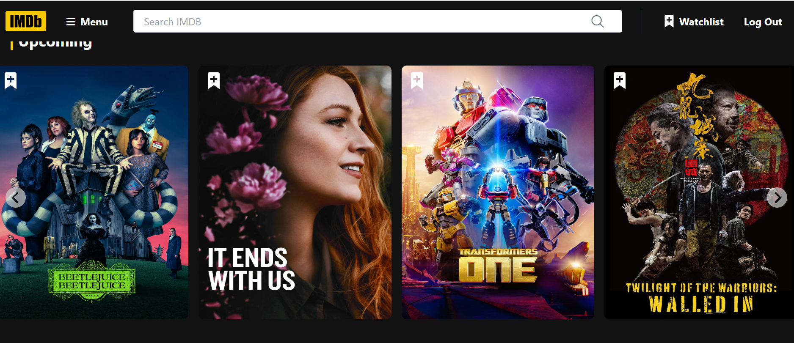

# IMDb Movie App

## 🙌 Introduction

IMDb  is a front-end application that allows users to browse various movies, view their details, and add them to a wishlist for future viewing.

## Features

- Responsive Design: The app is fully responsive, providing an optimal user experience across all devices.
- Search Functionality: Search for movies and web series.
- Authentication: Firebase authentication for user login and signup.
- State Management: Managed using Redux Toolkit.
- Icons: Integrated with React Icons for a modern look.
- Routing: Utilizes React Router DOM for seamless navigation between different pages.

  ## Technologies Used

- React: JavaScript library for building user interfaces.
- Tailwind CSS: Utility-first CSS framework for styling.
- Firebase: Authentication and backend integration.
- Redux Toolkit: State management for handling app-wide state.
- React Icons: Icon set for visual enhancement.
- TMDB API: Fetching music data.
- React Router DOM: Routing for navigation between components.
- HTML5: For structuring web content.

## ❓ How To Use

1. Fork this repository

2. Clone your repository (do not forget to add your account name):
   bash
   $ git clone https://github.com/[YOUR ACCOUNT NAME]/.

3. Go into the repository and install dependencies:
   bash

4. $ npm install

## Deployment Link

(https://ankit-imdb-clone7788.netlify.app/)

## Author

Ankit Kumar

## Email

ankitchauhandhoni@gmail.com

